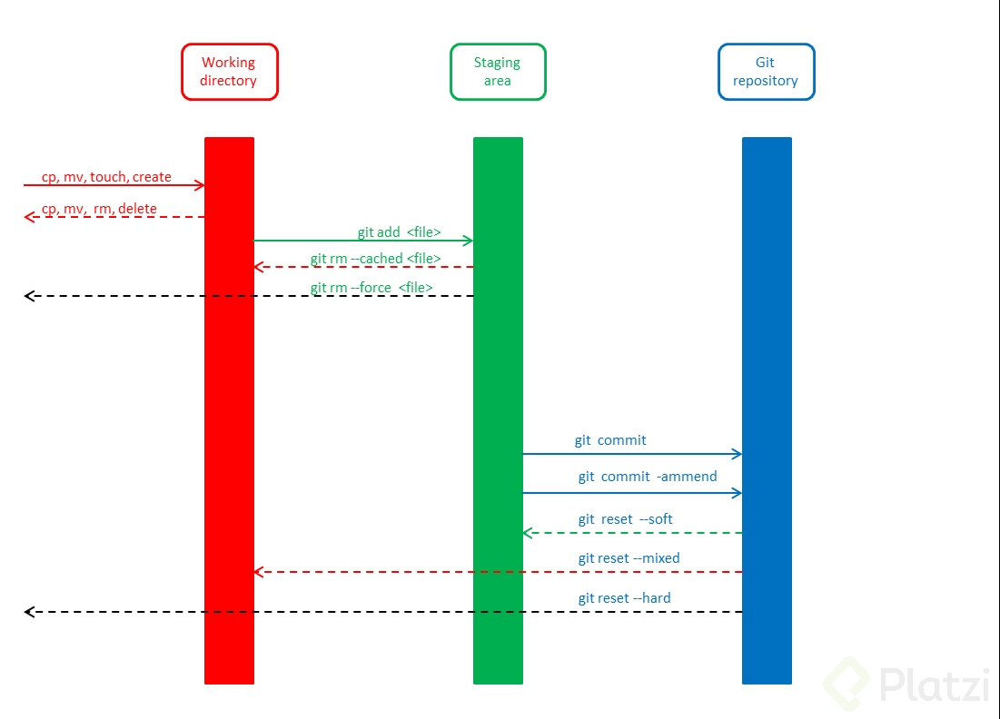

## GitHub

~~~
git show [file|commit] # see changes
git diff [commit] [commit]
git log [file|commit]  # also see changes
git commit --amend
git grep [regex] [directory]
git pull --rebase # avoid the merge commit
~~~

- To change the remote url: https://help.github.com/en/articles/changing-a-remotes-url
- To set upstream: https://stackoverflow.com/questions/45115391/change-destination-of-git-push
- Quite pretty log output
  
  `git log --graph --pretty=format:'%Cred%h%Creset -%C(yellow)%d%Creset %s %Cgreen(%cr) %C(bold blue)<%an>%Creset'`

- Push to a new branch:

  ~~~
  Create a new branch:
  git checkout -b feature_branch_name
  Edit, add and commit your files.
  Push your branch to the remote repository:
  git push -u origin feature_branch_name
  ~~~

- To change commits: https://stackoverflow.com/questions/12481639/remove-files-from-git-commit
- To reference a commit from a comment, in a issue for instance, you can copy the url and it will be automatically converted to a "pretty link". [+info](https://help.github.com/en/articles/autolinked-references-and-urls#commit-shas).
- To delete a commit:

  ~~~
  git reset --hard HEAD~1
  git push origin HEAD --force
  ~~~  
  
  ### Alias
  
  Go to `~/.gitconfig` and them like:
  
  ~~~
  [alias]
      st=status
  ~~~
  
  
