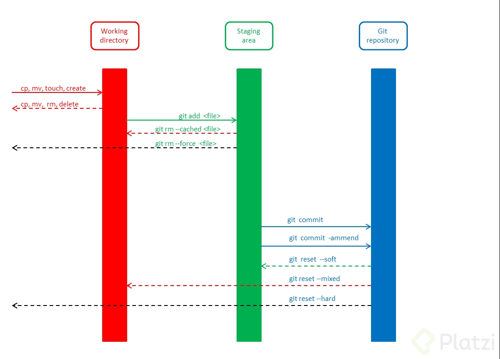

## GitHub

Sync a fork

https://help.github.com/en/articles/configuring-a-remote-for-a-fork
https://help.github.com/en/articles/syncing-a-fork
---

Deletes a tag => https://gist.github.com/mobilemind/7883996

---

sync a branch

~~~
git checkout b1
git merge master
# repeat for b2 and b3
~~~

---
~~~
git show [file|commit] # see changes
git log [file|commit]  # also see changes
~~~

---

To change the remote url: https://help.github.com/en/articles/changing-a-remotes-url

---

To set upstream: https://stackoverflow.com/questions/45115391/change-destination-of-git-push

---

Quite pretty log output

git log --graph --pretty=format:'%Cred%h%Creset -%C(yellow)%d%Creset %s %Cgreen(%cr) %C(bold blue)<%an>%Creset'

---

https://git-rebase.io/

MUY UTIL!!

use git rebase -i

---

Squash a branch into one commit only

https://stackoverflow.com/questions/5308816/how-to-use-git-merge-squash

---

git grep regex directory

---

Push to a new branch:

~~~
Create a new branch:
git checkout -b feature_branch_name
Edit, add and commit your files.
Push your branch to the remote repository:
git push -u origin feature_branch_name
~~~

---

To change commits: https://stackoverflow.com/questions/12481639/remove-files-from-git-commit

---

Undo operations: https://docs.gitlab.com/ee/topics/git/numerous_undo_possibilities_in_git/

---

To fix a commit message: `git commit --amend`

---

To reference a commit from a comment, in a issue for instance, you can copy the url and it will be automatically converted to a "pretty link". [+info](https://help.github.com/en/articles/autolinked-references-and-urls#commit-shas).

---

To delete a commit:

~~~
git reset --hard HEAD~1
git push origin HEAD --force
~~~

---

To avoid the merge commit:

~~~
git pull --rebase
~~~

---

## Linux

If you type `!<command>` in the terminal, it will execute `<command>` with previous arguments.

---

Use `sudo lsof -i :port` to see what process are using a specified port.

---

`find path -name regex` to search files.

---

## Shortcuts

To duplicate a line in VS Code: shift+alt+down

---

Shortcuts for terminator [here](https://askubuntu.com/questions/717965/what-is-the-shortcut-to-move-between-two-terminator-tabs).

---

## Random

To generate a markdown with the github-flavored style, you can use `grip README.md` (grip is a python module).

---
